# Quy tắc vận hành Agent cho dự án tuyển dụng Mekong Technology

## 1. Mục tiêu và phạm vi
- Thiết lập quy tắc thống nhất để các Agent phối hợp phát triển, bảo trì hệ thống tuyển dụng 3 bước (Step 1/2/3).
- Tất cả tài liệu dự án phải viết bằng tiếng Việt, ngoại trừ tên sản phẩm và các chữ viết tắt kỹ thuật (Flask, ORM, API, JWT, RBAC, PDF, SQL, CI/CD...).
- Không tạo các file tóm tắt ngoài yêu cầu. Chỉ bổ sung tài liệu khi có giá trị thực thi.

## 2. Vai trò Agent và ranh giới trách nhiệm

### 2.1. PM Agent (Điều phối dự án)
- Nhiệm vụ chính: Lập kế hoạch theo `DEVELOPMENT_TASKS.md`, ưu tiên hạng mục, theo dõi tiến độ và tiêu chí bàn giao.
- Đầu ra: Bảng công việc theo tuần, quyết định phạm vi sprint, checklist nghiệm thu.

### 2.2. Architecture/Explorer Agent (Kiến trúc & Khám phá mã)
- Nhiệm vụ chính: Khảo sát toàn bộ `app/`, chuẩn hóa kiến trúc theo `STRUCTURE_IMPROVEMENT.md`, phát hiện bất thường cấu hình.
- Quy tắc: Không để trùng khóa cấu hình. Ví dụ: gộp `QUESTION_MANAGEMENT` bị khai báo lặp trong `config.py` về một nơi duy nhất, tránh ghi đè không chủ đích.

### 2.3. Backend Agent (Flask & ORM)
- Nhiệm vụ chính: Hoàn thiện các blueprint trong `app/*.py`, bảo đảm luồng Step1→Step2→Step3 hoạt động đúng `APPROVAL_WORKFLOW`.
- Phạm vi: `app/assessment.py`, `app/interview.py`, `app/executive_decision.py`, `app/questions.py`, `app/link_management.py`, `app/commands.py`, `run.py`.

### 2.4. DB/Migrations Agent (CSDL & Di trú)
- Nhiệm vụ chính: Chuẩn hóa `app/models.py`, tạo di trú (Alembic), ràng buộc khóa ngoại, chỉ số, dữ liệu mẫu khớp `data/*.json`.
- Quy tắc: Sơ đồ dữ liệu là nguồn chân lý; di trú phải an toàn khi nâng cấp/rollback.

### 2.5. Security Agent (Bảo mật & Tuân thủ)
- Nhiệm vụ chính: Áp chính sách từ `config.py` (session, timeout, password, rate-limit), RBAC qua `app/decorators.py`, bảo vệ upload, CSRF, kiểm soát credentials tạm.
- Kiểm duyệt: Bất kỳ thay đổi liên quan xác thực/ủy quyền đều cần rà soát bởi Agent này trước khi phát hành.

### 2.6. QA/Testing Agent (Kiểm thử & Chất lượng)
- Nhiệm vụ chính: Bao phủ test trong `app/tests/*` (unit, integration), smoke test cài đặt (`install.bat`, `install.sh`), kiểm thử vai trò người dùng.
- Tiêu chí: Toàn bộ test phải xanh trước khi merge.

### 2.7. UI/UX Agent (Giao diện)
- Nhiệm vụ chính: Hoàn thiện `app/templates/*`, JS cho timer, autosave, anti-cheat, form validation; đảm bảo responsive.
- Thống nhất: Ngôn ngữ giao diện và thông báo người dùng đồng nhất; tránh trộn ngôn ngữ.

### 2.8. DevOps Agent (Tự động hoá & Triển khai)
- Nhiệm vụ chính: Chuẩn hóa `install.bat`, `install.sh`, bổ sung `wsgi.py` cho triển khai, quản lý `.env`, hướng tới CI/CD, đóng gói production (Gunicorn + nginx).
- Kiểm tra: Cài đặt sạch từ đầu theo README trên cả Windows và Linux.

### 2.9. Question Data Agent (Ngân hàng câu hỏi & Import/Export)
- Nhiệm vụ chính: API import/export JSON/CSV/Excel, validate lược đồ, thống kê sử dụng, giao diện `questions/bank.html`.
- Dữ liệu: Đồng bộ với `sample_question_import.json`, `data/step1_questions.json`, `data/step2_questions.json`, `data/step3_questions.json`.

### 2.10. Reporting/PDF Agent (Báo cáo & PDF)
- Nhiệm vụ chính: Hoàn thiện `app/pdf_export.py`, template PDF Step 3, xuất Excel/CSV trong `app/report_generation.py`.
- Chất lượng: Bố cục chuyên nghiệp, nhất quán thương hiệu công ty.

### 2.11. RBAC/Workflow Agent (Phân quyền & Quy trình)
- Nhiệm vụ chính: Ánh xạ `USER_ROLES` trong `config.py` vào decorators và view, bảo đảm workflow quyết định Step1/2/3 theo `APPROVAL_WORKFLOW`.
- Kiểm tra: Không rò rỉ quyền; chặn truy cập sai vai trò.

### 2.12. Performance/Monitoring Agent (Hiệu năng & Giám sát)
- Nhiệm vụ chính: Tối ưu truy vấn, phân trang, cache (Redis), logging/metrics trong `app/error_monitoring.py`, `app/performance_optimization.py`.
- Mục tiêu: P95 thời gian phản hồi thấp, truy vấn không N+1, giới hạn bộ nhớ.

### 2.13. Docs Agent (Tài liệu & Hướng dẫn)
- Nhiệm vụ chính: Cập nhật `README.md`, `PROJECT_SUMMARY.md`, `SOLUTION_1_DOCUMENTATION.md`, đồng bộ roadmap `DEVELOPMENT_TASKS.md`.
- Quy tắc: Tài liệu rõ ràng, đủ dùng, không thêm file phụ nếu không cần.

## 3. Nguyên tắc kỹ thuật chung
- Ngôn ngữ tài liệu: tiếng Việt; giữ nguyên tên riêng và chữ viết tắt kỹ thuật.
- Bảo mật mặc định: bật CSRF, hash mật khẩu (bcrypt), giới hạn 3 lần đăng nhập sai, session timeout theo `config.py`.
- Chất lượng mã:
  - Đặt tên có ý nghĩa, tránh viết tắt khó hiểu.
  - Ưu tiên early-return, xử lý lỗi và biên trước.
  - Bình luận ngắn gọn, giải thích “vì sao” thay vì “như thế nào”.
  - Không lạm dụng thay đổi định dạng không liên quan khi chỉnh sửa.
- Dữ liệu & di trú: thay đổi schema phải đi kèm migration, có script nâng cấp/rollback, seed dữ liệu an toàn.
- Cấu hình: Không trùng lặp khóa; mọi cấu hình có nguồn duy nhất trong `config.py`. Nếu cần tách, tạo namespacing rõ ràng.

## 4. Quy trình phát triển tiêu chuẩn
1) Lập kế hoạch: PM Agent phân rã task theo `DEVELOPMENT_TASKS.md` và ưu tiên.
2) Thiết kế/Phân tích: Architecture Agent tạo thiết kế chi tiết, cập nhật tài liệu liên quan.
3) Hiện thực: Backend/UI/DB triển khai tính năng theo chuẩn mục 3.
4) Kiểm thử: QA chạy unit/integration trong `app/tests/*`, smoke test cài đặt.
5) Rà soát bảo mật: Security Agent duyệt các thay đổi liên quan xác thực/ủy quyền/dữ liệu nhạy cảm.
6) Đóng gói & triển khai: DevOps kiểm thử `install.bat`, `install.sh`, `wsgi.py`, hướng dẫn `.env`, thử chạy production.
7) Cập nhật tài liệu: Docs Agent đồng bộ README và hướng dẫn sử dụng.

## 5. Checklist kiểm tra nhanh
- Cài đặt chạy được từ đầu:
  - `pip install -r requirements.txt`
  - `python run.py init-db && python run.py create-admin && python run.py`
  - Đăng nhập admin thành công.
- Kiểm thử:
  - Unit/Integration test xanh: `pytest -q` (nếu đã cấu hình CI, bắt buộc xanh).
- Bảo mật:
  - CSRF, session, giới hạn login, upload an toàn được bật.
  - Không có hardcode bí mật; `.env` được dùng cho thông tin nhạy cảm.
- Cấu hình:
  - Không trùng khóa trong `config.py` (đặc biệt nhóm câu hỏi và workflow).
  - Môi trường `development/production/testing` tách bạch.
- Dữ liệu:
  - Import câu hỏi hợp lệ; lược đồ JSON được validate.
  - Báo cáo/PDF xuất đúng định dạng.

## 6. Bản đồ sở hữu file (Ownership)
- PM: `DEVELOPMENT_TASKS.md`, điều phối toàn cục.
- Architecture: `app/` (tổng thể), `STRUCTURE_IMPROVEMENT.md`.
- Backend: `app/assessment.py`, `app/questions.py`, `app/interview.py`, `app/executive_decision.py`, `app/link_management.py`, `app/commands.py`, `run.py`.
- DB/Migrations: `app/models.py`, `app/migrations/`.
- Security: `app/security.py`, `app/decorators.py`, `config.py` (USER_ROLES, LINK_SECURITY, APPROVAL_WORKFLOW, CANDIDATE_CREDENTIALS).
- QA/Testing: `app/tests/*`.
- UI/UX: `app/templates/*`, `app/static/css/main.css`, `app/static/js/main.js`.
- DevOps: `install.bat`, `install.sh`, `wsgi.py`, `requirements.txt`, `.env` hướng dẫn.
- Question Data: `data/*.json`, `sample_question_import.json`, `app/templates/questions/bank.html`.
- Reporting/PDF: `app/pdf_export.py`, `app/report_generation.py`.
- RBAC/Workflow: `app/decorators.py`, các route bảo vệ quyền.
- Docs: `README.md`, `PROJECT_SUMMARY.md`, `SOLUTION_1_DOCUMENTATION.md`.

## 7. Sơ đồ vai trò và ánh xạ module

```mermaid
graph TD
  A["Điều phối dự án (PM Agent)"]
  B["Kiến trúc & Khám phá mã (Architecture/Explorer Agent)"]
  C["Backend Flask & ORM (Backend Agent)"]
  D["CSDL & Di trú (DB/Migrations Agent)"]
  E["Bảo mật & Tuân thủ (Security Agent)"]
  F["Kiểm thử & Chất lượng (QA/Testing Agent)"]
  G["Giao diện & UX (UI/UX Agent)"]
  H["Tự động hoá & Triển khai (DevOps Agent)"]
  I["Ngân hàng câu hỏi & Import/Export (Question Data Agent)"]
  J["Báo cáo & PDF (Reporting/PDF Agent)"]
  K["Phân quyền & Quy trình (RBAC/Workflow Agent)"]
  L["Hiệu năng & Giám sát (Performance/Monitoring Agent)"]
  M["Tài liệu & Hướng dẫn (Docs Agent)"]

  A --> B
  A --> C
  A --> D
  A --> E
  A --> F
  A --> G
  A --> H
  A --> I
  A --> J
  A --> K
  A --> L
  A --> M

  C --> c1["app/*.py"]
  D --> d1["app/models.py"]
  D --> d2["app/migrations/"]
  I --> i1["data/*.json"]
  J --> j1["app/pdf_export.py"]
  K --> k1["app/decorators.py"]
  K --> k2["config.py → USER_ROLES"]
  E --> e1["app/security.py"]
  H --> h1["install.bat / install.sh"]
  H --> h2["wsgi.py"]
  H --> h3["requirements.txt"]
  G --> g1["app/templates/*"]
  F --> f1["app/tests/*"]
  M --> m1["README.md"]
  M --> m2["PROJECT_SUMMARY.md"]
  M --> m3["DEVELOPMENT_TASKS.md"]
```

---

Tài liệu này là chuẩn làm việc cho nhóm. Khi có thay đổi lớn về kiến trúc, cập nhật mục 2 và 6 trước khi triển khai.

