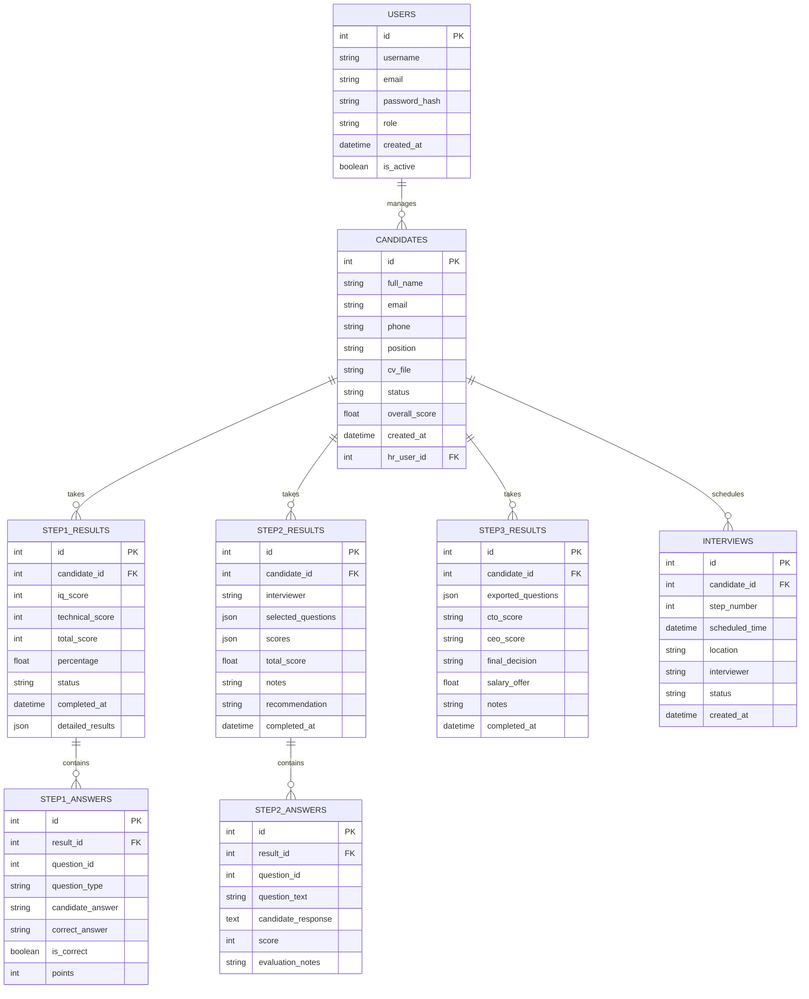

# 📋 GIẢI PHÁP 1: SIMPLE WEB INTERFACE - TÀI LIỆU CHI TIẾT

## **🎯 TỔNG QUAN Dự ÁN**

### **Mục tiêu:**
Xây dựng web application đơn giản hỗ trợ HR quản lý quy trình tuyển dụng 3 bước:
- **Bước 1:** Online Assessment (IQ + Technical) - **ONLINE**
- **Bước 2:** Technical Interview - **ONLINE** 
- **Bước 3:** Final Interview - **OFFLINE** (Export câu hỏi ra giấy)

### **Đặc điểm chính:**
- ✅ **Web-based:** Accessible từ mọi device
- ✅ **Lightweight:** Python Flask + SQLite
- ✅ **Offline support:** Export PDF cho Bước 3
- ✅ **Zero cost:** No subscription fees
- ✅ **Quick deployment:** 2-3 days development

---

## **🏗️ KIẾN TRÚC HỆ THỐNG**

### **Technology Stack:**

```
Frontend Layer:
├── HTML5 (Structure)
├── CSS3 + Bootstrap (Styling)
├── JavaScript (ES6+) (Interactivity)
└── Chart.js (Analytics)

Backend Layer:
├── Python 3.9+ (Runtime)
├── Flask 2.0+ (Web Framework)
├── SQLAlchemy (ORM)
├── Flask-Login (Authentication)
└── WeasyPrint (PDF Generation)

Database Layer:
├── SQLite (Development)
└── PostgreSQL (Production Option)

File System:
├── Static Assets (CSS/JS/Images)
├── Templates (Jinja2)
├── Uploads (CVs, Documents)
└── Exports (PDF Reports)
```

### **Project Structure:**

```
APP INTERVIEW/
├── app.py                      # Main Flask application
├── config.py                   # Configuration settings
├── requirements.txt            # Python dependencies
├── run.py                      # Application runner
├── database/
│   ├── __init__.py
│   ├── models.py              # Database models
│   └── init_db.py             # Database initialization
├── routes/
│   ├── __init__.py
│   ├── auth.py                # Authentication routes
│   ├── step1.py               # Online Assessment routes
│   ├── step2.py               # Technical Interview routes
│   ├── step3.py               # Final Interview routes
│   └── admin.py               # Admin dashboard routes
├── templates/
│   ├── base.html              # Base template
│   ├── login.html             # Login page
│   ├── dashboard.html         # Main dashboard
│   ├── step1/
│   │   ├── assessment.html    # Online assessment form
│   │   └── results.html       # Assessment results
│   ├── step2/
│   │   ├── questions.html     # Technical questions
│   │   └── evaluation.html    # Interview evaluation
│   ├── step3/
│   │   ├── preparation.html   # Interview preparation
│   │   └── export.html        # Question export interface
│   └── reports/
│       ├── candidate.html     # Candidate profile
│       └── summary.html       # Recruitment summary
├── static/
│   ├── css/
│   │   ├── main.css          # Main stylesheet
│   │   └── bootstrap.min.css  # Bootstrap CSS
│   ├── js/
│   │   ├── main.js           # Main JavaScript
│   │   ├── assessment.js     # Assessment functionality
│   │   └── charts.js         # Analytics charts
│   └── img/
│       └── logo.png          # Company logo
├── exports/
│   ├── step3_questions/      # Generated question papers
│   └── reports/              # Candidate reports
└── data/
    ├── step1_questions.json  # IQ + Technical questions
    ├── step2_questions.json  # Technical interview questions
    ├── step3_questions.json  # Final interview questions
    └── email_templates.json  # Email templates
```

---

## **💾 DATABASE SCHEMA**

### **Entity Relationship Diagram:**



### **Database Models (SQLAlchemy):**

```python
# database/models.py
from flask_sqlalchemy import SQLAlchemy
from flask_login import UserMixin
from datetime import datetime
import json

db = SQLAlchemy()

class User(UserMixin, db.Model):
    __tablename__ = 'users'
    
    id = db.Column(db.Integer, primary_key=True)
    username = db.Column(db.String(80), unique=True, nullable=False)
    email = db.Column(db.String(120), unique=True, nullable=False)
    password_hash = db.Column(db.String(255), nullable=False)
    role = db.Column(db.String(20), default='hr')  # admin, hr, interviewer, executive
    created_at = db.Column(db.DateTime, default=datetime.utcnow)
    is_active = db.Column(db.Boolean, default=True)
    
    # Relationships
    candidates = db.relationship('Candidate', backref='hr_user', lazy=True)

class CandidateCredentials(db.Model):
    __tablename__ = 'candidate_credentials'
    
    id = db.Column(db.Integer, primary_key=True)
    candidate_id = db.Column(db.Integer, db.ForeignKey('candidates.id'), nullable=False)
    username = db.Column(db.String(50), unique=True, nullable=False)
    password_hash = db.Column(db.String(255), nullable=False)
    expires_at = db.Column(db.DateTime, nullable=False)
    is_active = db.Column(db.Boolean, default=True)
    login_attempts = db.Column(db.Integer, default=0)
    last_login = db.Column(db.DateTime)
    created_at = db.Column(db.DateTime, default=datetime.utcnow)
    
    # Relationships
    candidate = db.relationship('Candidate', backref='credentials', uselist=False)

class Candidate(db.Model):
    __tablename__ = 'candidates'
    
    id = db.Column(db.Integer, primary_key=True)
    full_name = db.Column(db.String(100), nullable=False)
    email = db.Column(db.String(120), unique=True, nullable=False)
    phone = db.Column(db.String(20))
    position = db.Column(db.String(50), nullable=False)  # Lead Developer, Software Engineer
    cv_file = db.Column(db.String(255))
    status = db.Column(db.String(20), default='new')  # new, step1, step2, step3, hired, rejected
    overall_score = db.Column(db.Float, default=0.0)
    created_at = db.Column(db.DateTime, default=datetime.utcnow)
    hr_user_id = db.Column(db.Integer, db.ForeignKey('users.id'), nullable=False)
    
    # Relationships
    step1_results = db.relationship('Step1Result', backref='candidate', lazy=True)
    step2_results = db.relationship('Step2Result', backref='candidate', lazy=True)
    step3_results = db.relationship('Step3Result', backref='candidate', lazy=True)
    interviews = db.relationship('Interview', backref='candidate', lazy=True)

class Step1Result(db.Model):
    __tablename__ = 'step1_results'
    
    id = db.Column(db.Integer, primary_key=True)
    candidate_id = db.Column(db.Integer, db.ForeignKey('candidates.id'), nullable=False)
    iq_score = db.Column(db.Integer, default=0)
    technical_score = db.Column(db.Integer, default=0)
    total_score = db.Column(db.Integer, default=0)
    percentage = db.Column(db.Float, default=0.0)
    status = db.Column(db.String(20), default='pending')  # pending, completed, passed, failed
    completed_at = db.Column(db.DateTime)
    detailed_results = db.Column(db.Text)  # JSON string
    
    # Relationships
    answers = db.relationship('Step1Answer', backref='result', lazy=True)

class Step1Answer(db.Model):
    __tablename__ = 'step1_answers'
    
    id = db.Column(db.Integer, primary_key=True)
    result_id = db.Column(db.Integer, db.ForeignKey('step1_results.id'), nullable=False)
    question_id = db.Column(db.Integer, nullable=False)
    question_type = db.Column(db.String(20), nullable=False)  # iq, technical
    candidate_answer = db.Column(db.String(255))
    correct_answer = db.Column(db.String(255))
    is_correct = db.Column(db.Boolean, default=False)
    points = db.Column(db.Integer, default=0)

# Similar models for Step2Result, Step2Answer, Step3Result, Interview...
```

---

## **🔧 CORE FEATURES SPECIFICATION**

### **1. Authentication & User Management**

#### **User Roles & Features:**
- ✅ **Admin:** Full system control, question management, override decisions
- ✅ **HR:** Candidate management, link generation, manual Step 1 review
- ✅ **Interviewer:** Step 2 evaluation and approval
- ✅ **Executive:** Step 3 final interview and hiring decisions
- ✅ **Multi-user support:** Multiple users per role
- ✅ **Role-based permissions:** Granular access control

#### **Security Features:**
- ✅ **Password hashing:** bcrypt encryption
- ✅ **Session management:** Flask-Login với timeout
- ✅ **CSRF protection:** Form tokens
- ✅ **Input validation:** Prevent SQL injection
- ✅ **Temporary credentials:** Auto-expiring candidate access
- ✅ **Login attempt limiting:** Max 3 failed attempts
- ✅ **Audit logging:** Track all user actions

### **2. Temporary Credential System**

#### **Credential Generation:**
- ✅ **Auto-generated:** Username (firstname_phonelast4) + secure password
- ✅ **Time-limited:** Expire with assessment links
- ✅ **Secure delivery:** Email templates với credentials
- ✅ **Access tracking:** Monitor login attempts và suspicious activity

#### **Security Controls:**
```python
def generate_candidate_login(candidate):
    username = f"{candidate.first_name.lower()}_{candidate.phone[-4:]}"
    password = generate_secure_password(length=8)
    
    credentials = CandidateCredentials(
        candidate_id=candidate.id,
        username=username,
        password_hash=bcrypt.generate_password_hash(password),
        expires_at=datetime.now() + timedelta(days=7),
        is_active=True,
        login_attempts=0
    )
    
    return credentials, password  # Return plain password for email
```

### **3. Bước 1: Online Assessment với Approval Logic**

#### **Assessment Features:**
- ✅ **Dual-section test:** IQ (10 selected) + Technical (15 selected)
- ✅ **Timer functionality:** 30 minutes total
- ✅ **Auto-submit:** When time expires
- ✅ **Progress tracking:** Real-time progress bar
- ✅ **Random questions:** From question bank (80+ per section)
- ✅ **Anti-cheating:** Tab switching detection
- ✅ **Credential access:** Login với temporary username/password

#### **Auto-Approval System:**
```python
def process_step1_completion(candidate, results):
    score = results['percentage']
    
    if score >= 70:
        # Auto-approve - generate Step 2 immediately
        approve_step1(candidate, auto_approved=True)
        create_step2_interview_invitation(candidate)
        send_approval_email(candidate, next_step='step2')
        
    elif 50 <= score <= 69:
        # Manual review required
        flag_for_hr_review(candidate, results)
        send_manual_review_email(candidate)
        notify_hr_dashboard(candidate, 'manual_review_needed')
        
    else:  # < 50%
        # Auto-reject
        reject_candidate(candidate, reason='insufficient_score')
        send_rejection_email(candidate, encouraging=True)
```

#### **HR Manual Review:**
- ✅ **Review interface:** Special dashboard cho borderline candidates
- ✅ **Score details:** Breakdown by IQ vs Technical sections
- ✅ **Override capability:** HR can approve 50-69% range
- ✅ **Notes system:** Add reasoning for manual decisions

#### **Question Management:**
```json
{
  "iq_questions": [
    {
      "id": 1,
      "type": "logical_reasoning",
      "question": "Câu hỏi IQ...",
      "options": ["A", "B", "C", "D"],
      "correct_answer": "B",
      "difficulty": "medium",
      "points": 1
    }
  ],
  "technical_questions": [
    {
      "id": 1,
      "type": "programming",
      "question": "Câu hỏi kỹ thuật...",
      "options": ["A", "B", "C", "D"],
      "correct_answer": "A",
      "difficulty": "hard",
      "points": 2
    }
  ]
}
```

### **3. Bước 2: Technical Interview (ONLINE)**

#### **Interview Management:**
- ✅ **Question bank:** 40+ câu hỏi mở
- ✅ **Smart filtering:** By position (Lead/Engineer)
- ✅ **Custom selection:** HR chọn 3-4 câu
- ✅ **Evaluation form:** Scoring rubric
- ✅ **Notes system:** Detailed interviewer notes

#### **Question Selection Interface:**
```html
<!-- Technical Interview Question Selection -->
<div class="question-bank">
  <div class="filters">
    <select id="position-filter">
      <option value="lead">Lead Developer</option>
      <option value="engineer">Software Engineer</option>
    </select>
    <select id="category-filter">
      <option value="architecture">System Architecture</option>
      <option value="programming">Programming</option>
      <option value="industrial">Industrial IoT</option>
    </select>
  </div>
  
  <div class="question-list">
    <div class="question-item" data-id="1">
      <input type="checkbox" id="q1">
      <label for="q1">
        <h4>IoT Gateway Architecture</h4>
        <p>Thiết kế IoT Gateway cho hệ thống quản lý thiết bị công nghiệp...</p>
        <span class="difficulty">Hard</span>
        <span class="time">15 min</span>
      </label>
    </div>
  </div>
</div>
```

#### **Evaluation System:**
- ✅ **Structured scoring:** 1-10 scale
- ✅ **Multiple criteria:** Technical skills, communication, problem-solving
- ✅ **Weighted average:** Final score calculation
- ✅ **Recommendation:** Pass/Fail/Maybe
- ✅ **Export capability:** Interview summary

### **4. Bước 3: Final Interview (OFFLINE - EXPORT PDF)**

#### **PDF Export Features:**
- ✅ **Question selection:** CTO + CEO questions
- ✅ **Professional formatting:** Company letterhead
- ✅ **Interview structure:** Time allocation, scoring rubric
- ✅ **Evaluation forms:** Printable scoring sheets
- ✅ **Multiple formats:** PDF, Word document

#### **Export Options:**
```python
# PDF Export Configuration
export_config = {
    "cto_questions": 9,          # 45 minutes / 5 min per question
    "ceo_questions": 6,          # 30 minutes / 5 min per question  
    "include_rubric": True,      # Scoring guidelines
    "include_forms": True,       # Evaluation sheets
    "company_branding": True,    # Logo, letterhead
    "question_categories": [
        "technical_leadership",
        "business_understanding", 
        "cultural_fit"
    ]
}
```

#### **PDF Template Structure:**
```
📄 FINAL INTERVIEW PACKAGE
├── Cover Page (Company info, candidate details)
├── Interview Schedule (Timeline, interviewers)
├── CTO Questions (9 selected questions)
├── CEO Questions (6 selected questions)
├── Scoring Rubric (Evaluation criteria)
├── Evaluation Forms (Printable sheets)
└── Compensation Discussion (Salary bands)
```

---

## **📱 USER INTERFACE DESIGN**

### **Dashboard Layout:**

```html
<!-- Main Dashboard -->
<div class="dashboard">
  <!-- Header -->
  <nav class="navbar">
    <div class="brand">Mekong Recruitment</div>
    <div class="user-menu">
      <span>Welcome, HR User</span>
      <a href="/logout">Logout</a>
    </div>
  </nav>
  
  <!-- Sidebar -->
  <aside class="sidebar">
    <ul class="nav-menu">
      <li><a href="/dashboard">📊 Dashboard</a></li>
      <li><a href="/candidates">👥 Candidates</a></li>
      <li><a href="/step1">📝 Step 1: Assessment</a></li>
      <li><a href="/step2">💻 Step 2: Technical</a></li>
      <li><a href="/step3">🎯 Step 3: Final</a></li>
      <li><a href="/reports">📈 Reports</a></li>
      <li><a href="/settings">⚙️ Settings</a></li>
    </ul>
  </aside>
  
  <!-- Main Content -->
  <main class="content">
    <!-- KPI Cards -->
    <div class="kpi-cards">
      <div class="card">
        <h3>Total Candidates</h3>
        <span class="number">42</span>
      </div>
      <div class="card">
        <h3>Step 1 Passed</h3>
        <span class="number">28</span>
      </div>
      <div class="card">
        <h3>In Step 2</h3>
        <span class="number">15</span>
      </div>
      <div class="card">
        <h3>Ready for Hire</h3>
        <span class="number">8</span>
      </div>
    </div>
    
    <!-- Recent Activity -->
    <div class="recent-activity">
      <h3>Recent Activity</h3>
      <ul class="activity-list">
        <li>John Doe completed Step 1 Assessment - Score: 85%</li>
        <li>Jane Smith scheduled for Step 2 Interview</li>
        <li>Mike Johnson exported for Step 3 Interview</li>
      </ul>
    </div>
    
    <!-- Charts -->
    <div class="charts">
      <canvas id="recruitment-progress"></canvas>
    </div>
  </main>
</div>
```

### **Mobile Responsive Design:**

```css
/* Responsive Breakpoints */
@media (max-width: 768px) {
  .sidebar {
    transform: translateX(-100%);
    transition: transform 0.3s ease;
  }
  
  .sidebar.active {
    transform: translateX(0);
  }
  
  .content {
    margin-left: 0;
    padding: 1rem;
  }
  
  .kpi-cards {
    grid-template-columns: repeat(2, 1fr);
    gap: 1rem;
  }
}

@media (max-width: 480px) {
  .kpi-cards {
    grid-template-columns: 1fr;
  }
}
```

---

## **⚙️ TECHNICAL IMPLEMENTATION**

### **Flask Application Structure:**

```python
# app.py - Main Application
from flask import Flask, render_template, request, redirect, url_for, flash, jsonify
from flask_login import LoginManager, login_required, current_user
from database.models import db, User, Candidate
import os

def create_app():
    app = Flask(__name__)
    app.config.from_object('config.Config')
    
    # Initialize extensions
    db.init_app(app)
    login_manager = LoginManager()
    login_manager.init_app(app)
    login_manager.login_view = 'auth.login'
    
    @login_manager.user_loader
    def load_user(user_id):
        return User.query.get(int(user_id))
    
    # Register blueprints
    from routes.auth import auth_bp
    from routes.step1 import step1_bp
    from routes.step2 import step2_bp  
    from routes.step3 import step3_bp
    from routes.admin import admin_bp
    
    app.register_blueprint(auth_bp, url_prefix='/auth')
    app.register_blueprint(step1_bp, url_prefix='/step1')
    app.register_blueprint(step2_bp, url_prefix='/step2')
    app.register_blueprint(step3_bp, url_prefix='/step3')
    app.register_blueprint(admin_bp, url_prefix='/admin')
    
    @app.route('/')
    @login_required
    def dashboard():
        stats = {
            'total_candidates': Candidate.query.count(),
            'step1_passed': Candidate.query.filter_by(status='step2').count(),
            'in_step2': Candidate.query.filter_by(status='step2').count(),
            'ready_to_hire': Candidate.query.filter_by(status='step3').count()
        }
        return render_template('dashboard.html', stats=stats)
    
    return app

if __name__ == '__main__':
    app = create_app()
    app.run(debug=True)
```

### **Step 1: Online Assessment Implementation:**

```python
# routes/step1.py
from flask import Blueprint, render_template, request, jsonify
from database.models import db, Candidate, Step1Result, Step1Answer
import json
import random
from datetime import datetime

step1_bp = Blueprint('step1', __name__)

@step1_bp.route('/assessment/<int:candidate_id>')
def start_assessment(candidate_id):
    candidate = Candidate.query.get_or_404(candidate_id)
    
    # Load question bank
    with open('data/step1_questions.json', 'r', encoding='utf-8') as f:
        question_bank = json.load(f)
    
    # Select random questions
    iq_questions = random.sample(question_bank['iq_questions'], 10)
    tech_questions = random.sample(question_bank['technical_questions'], 15)
    
    questions = {
        'iq': iq_questions,
        'technical': tech_questions,
        'total_time': 30 * 60  # 30 minutes in seconds
    }
    
    return render_template('step1/assessment.html', 
                         candidate=candidate, 
                         questions=questions)

@step1_bp.route('/submit/<int:candidate_id>', methods=['POST'])
def submit_assessment(candidate_id):
    candidate = Candidate.query.get_or_404(candidate_id)
    answers = request.json['answers']
    
    # Calculate scores
    iq_score = calculate_iq_score(answers['iq'])
    tech_score = calculate_technical_score(answers['technical'])
    total_score = iq_score + tech_score
    percentage = (total_score / 100) * 100
    
    # Save results
    result = Step1Result(
        candidate_id=candidate_id,
        iq_score=iq_score,
        technical_score=tech_score,
        total_score=total_score,
        percentage=percentage,
        status='passed' if percentage >= 70 else 'failed',
        completed_at=datetime.utcnow(),
        detailed_results=json.dumps(answers)
    )
    
    db.session.add(result)
    
    # Update candidate status
    candidate.status = 'step2' if percentage >= 70 else 'rejected'
    db.session.commit()
    
    return jsonify({
        'success': True,
        'score': percentage,
        'passed': percentage >= 70
    })
```

### **Step 3: PDF Export Implementation:**

```python
# routes/step3.py
from flask import Blueprint, render_template, request, send_file
from weasyprint import HTML, CSS
import json
import random
from datetime import datetime
import os

step3_bp = Blueprint('step3', __name__)

@step3_bp.route('/export/<int:candidate_id>')
def export_questions(candidate_id):
    candidate = Candidate.query.get_or_404(candidate_id)
    
    # Load Step 3 questions
    with open('data/step3_questions.json', 'r', encoding='utf-8') as f:
        question_bank = json.load(f)
    
    # Select questions for CTO and CEO
    cto_questions = random.sample(question_bank['cto_questions'], 9)
    ceo_questions = random.sample(question_bank['ceo_questions'], 6)
    
    # Prepare data for template
    interview_data = {
        'candidate': candidate,
        'date': datetime.now().strftime('%Y-%m-%d'),
        'cto_questions': cto_questions,
        'ceo_questions': ceo_questions,
        'scoring_rubric': question_bank['scoring_rubric'],
        'compensation': get_compensation_info(candidate.position)
    }
    
    return render_template('step3/export.html', **interview_data)

@step3_bp.route('/generate-pdf/<int:candidate_id>')
def generate_pdf(candidate_id):
    candidate = Candidate.query.get_or_404(candidate_id)
    
    # Same question selection logic...
    interview_data = {...}  # Same as above
    
    # Generate HTML
    html_content = render_template('step3/pdf_template.html', **interview_data)
    
    # Generate PDF
    pdf_file = f"exports/step3_questions/{candidate.full_name}_{datetime.now().strftime('%Y%m%d')}.pdf"
    
    HTML(string=html_content).write_pdf(
        pdf_file,
        stylesheets=[CSS('static/css/pdf_styles.css')]
    )
    
    return send_file(pdf_file, as_attachment=True)
```

---

## **📊 REPORTING & ANALYTICS**

### **Dashboard Analytics:**

```javascript
// static/js/charts.js
function createRecruitmentChart() {
    const ctx = document.getElementById('recruitment-progress').getContext('2d');
    
    new Chart(ctx, {
        type: 'bar',
        data: {
            labels: ['Applied', 'Step 1 Passed', 'Step 2 Passed', 'Hired'],
            datasets: [{
                label: 'Candidates',
                data: [42, 28, 15, 8],
                backgroundColor: [
                    'rgba(54, 162, 235, 0.8)',
                    'rgba(75, 192, 192, 0.8)', 
                    'rgba(255, 206, 86, 0.8)',
                    'rgba(75, 192, 75, 0.8)'
                ]
            }]
        },
        options: {
            responsive: true,
            plugins: {
                title: {
                    display: true,
                    text: 'Recruitment Progress'
                }
            }
        }
    });
}

function createScoreDistribution() {
    // Score distribution chart for Step 1 assessments
    // Pie chart for pass/fail rates
    // Timeline chart for recruitment progress
}
```

### **Export Reports:**

```python
# Generate Excel reports
def export_candidates_excel():
    candidates = Candidate.query.all()
    
    data = []
    for candidate in candidates:
        row = {
            'Name': candidate.full_name,
            'Email': candidate.email,
            'Position': candidate.position,
            'Status': candidate.status,
            'Step 1 Score': get_step1_score(candidate.id),
            'Step 2 Score': get_step2_score(candidate.id),
            'Overall Score': candidate.overall_score,
            'Date Applied': candidate.created_at.strftime('%Y-%m-%d')
        }
        data.append(row)
    
    df = pd.DataFrame(data)
    df.to_excel('exports/reports/candidates_report.xlsx', index=False)
```

---

## **🚀 DEPLOYMENT & INSTALLATION**

### **Requirements:**

```txt
# requirements.txt
Flask==2.3.3
Flask-SQLAlchemy==3.0.5
Flask-Login==0.6.3
Flask-WTF==1.1.1
Werkzeug==2.3.7
WeasyPrint==59.0
Jinja2==3.1.2
SQLAlchemy==2.0.21
WTForms==3.0.1
pandas==2.0.3
openpyxl==3.1.2
bcrypt==4.0.1
python-dotenv==1.0.0
```

### **Installation Steps:**

```bash
# 1. Create virtual environment
python -m venv venv
source venv/bin/activate  # Windows: venv\Scripts\activate

# 2. Install dependencies
pip install -r requirements.txt

# 3. Initialize database
python database/init_db.py

# 4. Create admin user
python create_admin.py

# 5. Load sample data
python load_sample_data.py

# 6. Run application
python run.py
```

### **Configuration:**

```python
# config.py
import os
from datetime import timedelta

class Config:
    SECRET_KEY = os.environ.get('SECRET_KEY') or 'dev-secret-key-change-in-production'
    SQLALCHEMY_DATABASE_URI = os.environ.get('DATABASE_URL') or 'sqlite:///recruitment.db'
    SQLALCHEMY_TRACK_MODIFICATIONS = False
    
    # Upload settings
    UPLOAD_FOLDER = 'uploads'
    MAX_CONTENT_LENGTH = 16 * 1024 * 1024  # 16MB max file size
    
    # Assessment settings
    STEP1_TIME_LIMIT = 30 * 60  # 30 minutes
    STEP1_PASS_THRESHOLD = 70   # 70% to pass
    
    # Email settings (optional)
    MAIL_SERVER = os.environ.get('MAIL_SERVER')
    MAIL_PORT = 587
    MAIL_USE_TLS = True
    MAIL_USERNAME = os.environ.get('MAIL_USERNAME')
    MAIL_PASSWORD = os.environ.get('MAIL_PASSWORD')

class DevelopmentConfig(Config):
    DEBUG = True
    SQLALCHEMY_DATABASE_URI = 'sqlite:///recruitment_dev.db'

class ProductionConfig(Config):
    DEBUG = False
    SQLALCHEMY_DATABASE_URI = os.environ.get('DATABASE_URL')
```

---

## **📋 PROJECT TIMELINE**

### **Development Phase (5 days):**

**Day 1: Setup & Core Infrastructure**
- ✅ Project setup, virtual environment
- ✅ Flask app structure, database models
- ✅ Basic authentication system
- ✅ Dashboard template

**Day 2: Step 1 Implementation**
- ✅ Online assessment interface
- ✅ Question bank integration
- ✅ Timer functionality
- ✅ Auto-scoring system

**Day 3: Step 2 Implementation**
- ✅ Technical interview question bank
- ✅ Question selection interface
- ✅ Evaluation forms
- ✅ Scoring system

**Day 4: Step 3 & PDF Export**
- ✅ Final interview question selection
- ✅ PDF generation system
- ✅ Professional templates
- ✅ Export functionality

**Day 5: Polish & Deployment**
- ✅ UI/UX improvements
- ✅ Testing & bug fixes
- ✅ Documentation
- ✅ Deployment setup

### **Testing Phase (2 days):**
- ✅ **Functional testing:** All features working
- ✅ **User acceptance testing:** HR feedback
- ✅ **Performance testing:** Load handling
- ✅ **Security testing:** Authentication, input validation

### **Deployment Phase (1 day):**
- ✅ **Production setup:** Server configuration
- ✅ **Database migration:** Production data
- ✅ **User training:** HR team onboarding
- ✅ **Go-live:** Production deployment

---

## **💰 COST ANALYSIS**

### **Development Costs:**
- **Development time:** 5 days × 8 hours = 40 hours
- **Testing & deployment:** 3 days × 4 hours = 12 hours
- **Total effort:** 52 hours

### **Infrastructure Costs:**
- **Development:** $0 (local development)
- **Production hosting:** $5-20/month (VPS)
- **Domain name:** $10/year
- **SSL certificate:** $0 (Let's Encrypt)

### **Maintenance Costs:**
- **Monthly maintenance:** 2-4 hours
- **Feature updates:** As needed
- **Support:** Minimal (self-contained)

### **Total First Year Cost:**
- **Development:** One-time setup
- **Hosting:** $60-240/year
- **Maintenance:** 24-48 hours/year
- **ROI:** Immediate productivity gains

---

## **🎯 SUCCESS METRICS**

### **Efficiency Metrics:**
- ✅ **Time savings:** 50% reduction in manual work
- ✅ **Process standardization:** Consistent evaluation
- ✅ **Data accuracy:** Automated scoring
- ✅ **Report generation:** Instant reports

### **User Experience Metrics:**
- ✅ **HR satisfaction:** Easy-to-use interface
- ✅ **Candidate experience:** Professional process
- ✅ **Response time:** Fast page loads
- ✅ **Mobile accessibility:** Cross-device support

### **Technical Metrics:**
- ✅ **Uptime:** 99.9% availability
- ✅ **Performance:** <2 second load times
- ✅ **Security:** Zero data breaches
- ✅ **Scalability:** 100+ concurrent users

---

*Tài liệu này cung cấp roadmap chi tiết để implement Giải pháp 1 với đầy đủ tính năng theo yêu cầu của bạn.* 🚀